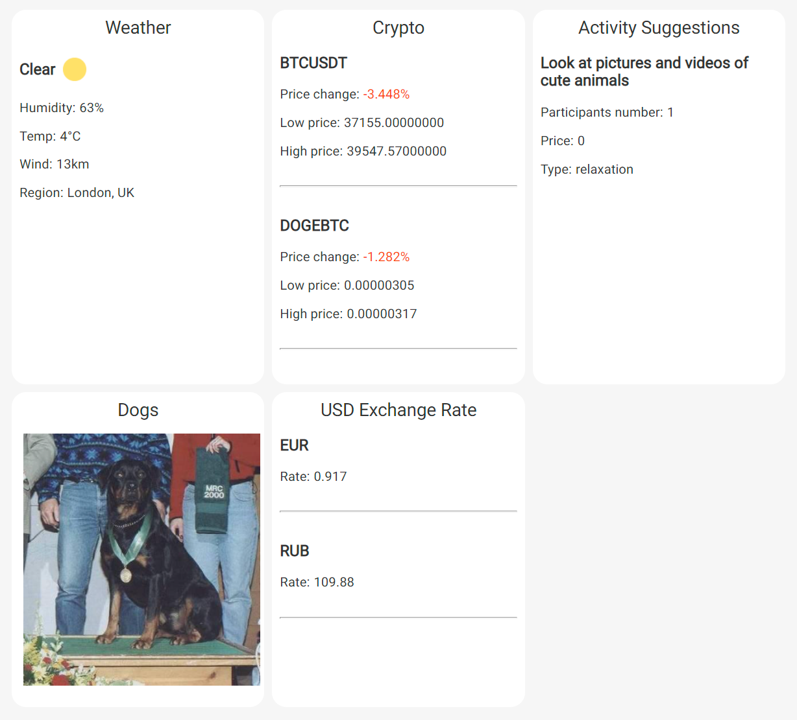

# Simple Raspberry PI Dashboard
There's five implemented public API's to show some valuable data like weather or dogs.



## How to use
Firstly, you need to install git environment on your Raspberry PI:
```
sudo apt-get install git
```
Then you can clone this repository with this command:
```
git clone https://github.com/pavelpilyak/pi-dashboard.git
```
Now open the **index.html** file in your browser. That's it

## Settings
You can hide some data displayed on dashboard editing **app/config/tiles.js** file:
```js
const tiles = [
    // 'bored',
    'crypto',
    // 'dogs',
    'exchange',
    'weather',
];
```

Location, tickers, exchange currency is also changeable in **app/constants.js**